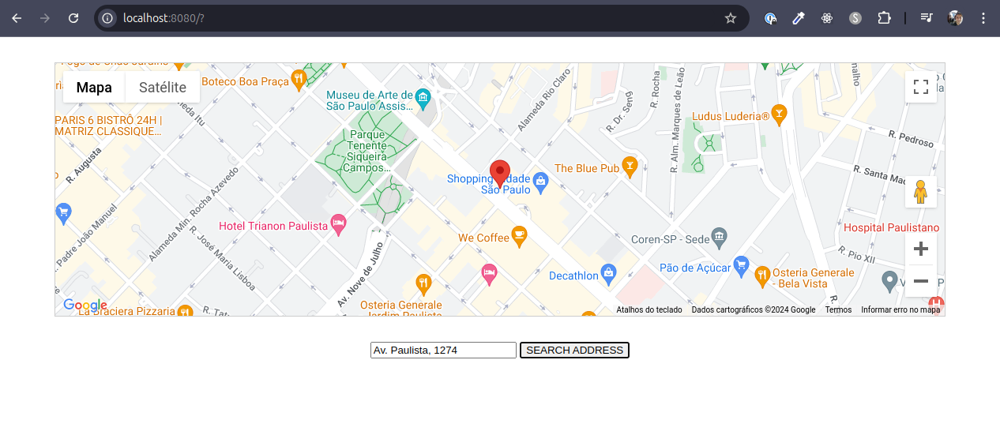

# Select And Share Place - Google Maps

Basic project using Google Maps Geocoding API. It search an address and render a new map on screen with the correct marker.

### Dependencies
* TypeScript;
* Webpack;
* Google API;
* Axios.

